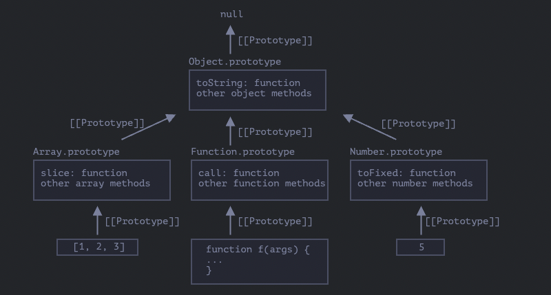

# 프로토타입과 프로토타입 상속

## 프로퍼티의 상속

개발을 하다보면 기능을 따로 가져와서 확장해야하는 경우가 있다.

예를 들어 Pet이라는 객체가 있는데 상당히 유사하지만 차이가 있는 Cat과 Dog 객체를 만들어야한다고 가정해보자.

Pet에 약간의 기능을 얹어서 구현할 수 있을 수 있지 않을까? 라는 꼼수를 고민합니다..

자바스크립트에서는 이에 대해서 프로토타입 상속이라는 것을 통해 이를 실현할 수 있다는 것을 알고 있어야합니다.

### [[Prototype]]

자바스크립트에는 `[[Prototype]]`라는 하나의 숨김 객체가 있다.

이 프로퍼티는 `null` 혹은 다른 객체에 대한 참조가 있습니다.
다른 객체를 참조하는 경우 참조 대상을 `Prototype`이라고 한다.

이는 자바스크립트에서 `object`에서, 즉 객체에서 프로퍼티를 읽으려할 때 해당 프로퍼티가 없는 경우
자동으로 `Prototype`에서 프로퍼티를 탐색하게 된다.
=> 이러한 동작 방식을 `프로퍼티 참조`라고 한다.

`[[Prototype]]` 프로퍼티는 내부 프로퍼티이면서 숨김 프로퍼티이지만 다양한 방법을 사용해 개발자가 값을 설정할 수 있다.

```js
let animal = {
  eats: true,
};
let rabbit = {
  jumps: true,
};

rabbit.__proto__ = animal; // rabbit.__proto__를 통해 새로 정의
//__proto__는 [[Prototype]]용 getter·setter 이다.
alert(rabbit.eats); // true (**)
alert(rabbit.jumps); // true
```

여기서 중요한 것은 `_proto__`과 `[[Prototype]]`는 다르다는 것을 인지해야한다. `__proto__`는 `[[Prototype]]`의 `getter`(획득자)이자`setter`(설정자) 이다.

그리고 위와 같이 세팅이 된다면 위에서 말했던 내용과 같이 프로토타입 참조 과정이 발생한다는 것을 알 수 있다.
먼저 `rabbit`에는 기본적으로 `eats` 라는 프로퍼티가 없습니다. 여기서 없다면 프로토타입 참조가 발생하여 `rabbit`에 `[[Prototype]]`을 참조해서 `eats`를 가져오게 되어 `true`가 나오게 된다.

이러한 프로토타입은 위에 프로토타입에 대해서 프로토타입을 들어가는 하나의 프로토타입 체이닝도 가능하지만 제약사항이 있다.

- 순환 참조(circular reference)는 허용되지 않는다.
  - **proto**를 이용해 닫힌 형태로 다른 객체를 참조하면 에러가 발생.
- **proto**의 값은 객체나 null만 가능.
  - 다른 자료형은 무시된다.
- 객체엔 오직 하나의 [[Prototype]]만 있을 수 있다.
  - 객체는 두 개의 객체를 상속받지 못한다.

## 프로토타입은 읽기 전용이다.

프로토타입은 프로퍼티를 읽을 때만 사용하며, 프로퍼티를 추가, 수정하거나 지우는 연산은 객체에 직접 해야한다.

직접 할당하는 경우에는 프로토타입이 아닌 할당하는 객체에 할당하지만, 여기 특별한 예시가 하나 있습니다.

```js
let user = {
  name: "John",
  surname: "Smith",

  set fullName(value) {
    [this.name, this.surname] = value.split(" ");
  },

  get fullName() {
    return `${this.name} ${this.surname}`;
  },
};

let admin = {
  __proto__: user,
  isAdmin: true,
};

alert(admin.fullName); // John Smith (*)

// setter 함수가 실행됩니다!
admin.fullName = "Alice Cooper"; // (**)

alert(admin.fullName); // Alice Cooper, setter에 의해 추가된 admin의 프로퍼티(name, surname)에서 값을 가져옴
alert(user.fullName); // John Smith, 본래 user에 있었던 프로퍼티 값
```

프로토타입 `user`엔 `getter` 함수 `get fullName`이 있기 때문에 `(*)`로 표시한 줄에선 `get fullName`이 호출되었다. 마찬가지로 프로토타입에 이미 `setter` 함수`(set fullName)`가 정의되어 있기 때문에 `(**)`로 표시한 줄의 할당 연산이 실행되면 객체 user에 프로퍼티가 추가되는게 아니라 프로토타입에 있는 `setter` 함수가 호출된다.

하지만 여기서 우리는 `this`값이 분명 `user`를 따라가야하지 않나를 고민이 됩니다.
답은 간단하게도 **`this`는 프로토타입의 영향을 받지 않는다** 이다.

**메서드를 객체에서 호출했든 프로토타입에서 호출했든 상관없이 this는 언제나 . 앞에 있는 객체이다.**

위와 같은 경우에서 `admin.fullName`이라는 곳에서 `this`는 `user`가 아닌 `admin`이 된다.

위와 같이 프로퍼티가 난잡한 경우, 프로퍼티가 상속이냐 아니냐를 구분하는 방법은 `obj.hasOwnProperty(key)`를 활용해서
본인의 프로퍼티인지 상속받은 프로퍼티인지를 구분할 수 있다.

## 함수의 프로토타입 프로퍼티

생성자 '함수’를 사용해 객체를 만든 경우에 프로토타입이 어떻게 동작하는지에 대해 알아보자

생성자 함수로 객체를 만들었을 때 리터럴 방식과 다른점으로는 생성자 함수의 프로토타입이 객체인 경우에 new 연산자를 사용해 만든 객체는 생성자 함수의 프로토타입 정보를 사용해 `[[Prototype]]`을 설정한다는 것이다.

생성자함수의 프로토타입에서 `Rabbit.prototype = animal`은 "`new Rabbit`을 호출해 만든 새로운 객체의 `[[Prototype]]`을 `animal`로 설정하라."는 것을 의미한다.

```js
let animal = {
  eats: true,
};

function Rabbit(name) {
  this.name = name;
}

Rabbit.prototype = animal;

let rabbit = new Rabbit("흰 토끼"); //  rabbit.__proto__ == animal

alert(rabbit.eats); // true
```

### 함수의 디폴트 프로토타입 prototype과 constructor 프로퍼티

개발자가 특별히 할당하지 않더라도 모든 함수는 기본적으로 `"prototype"` 프로퍼티를 갖는다.
프로퍼티 `"prototype"`는 `constructor` 프로퍼티 하나만 있는 객체를 가리키는데, 여기서 `constructor` 프로퍼티는 함수 자신을 가리키게 된다.

```js
function Rabbit() {}
// 함수를 만들기만 해도 디폴트 프로퍼티인 prototype이 설정.
// Rabbit.prototype = { constructor: Rabbit }

alert(Rabbit.prototype.constructor == Rabbit); // true
```

constructor 프로퍼티는 기존에 있던 객체의 constructor를 사용해 새로운 객체를 만들때 사용할 수 있다.

```js
function Rabbit(name) {
  this.name = name;
  alert(name);
}

let rabbit = new Rabbit("흰 토끼");

let rabbit2 = new rabbit.constructor("검정 토끼");
```

`"constructor"`를 이야기 할 때 가장 중요한 점은

**자바스크립트는 알맞은 "constructor" 값을 보장하지 않는다**는 점이다.

모든 함수는 기본적으로 F.prototype = { constructor : F }를 가지고 있으므로 "constructor" 프로퍼티를 사용하면 객체의 생성자를 얻을 수이 있다.

## 내장 객체의 프로토타입

모든 내장 생성자 함수에서 프로퍼티를 사용하는데, 내장 객체의 프로토타입에 대해 자세히 알아보자

### Object.prototype

빈 객체를 사용하면서 우리는 이런 타입을 볼 수 있다.

```js
let obj = {};
alert(obj); // "[object Object]" 출력
```

obj는 분명 비어있는 객체지만 `[object Object]`라는 문자열이 출력됩니다. 이 데이터는 어디서 나왔는가?

`obj = {}`는 다르게 보면 `obj = new Object()`라는 것임을 알고 있으면 된다.
이렇게 생성자를 하게 된다면 obj의 Prototype은 `Object`를 가리키게 된다.

따라서 `obj.toString()`을 호출하면 `Object.prototype`에서 해당 메서드를 가져오게 된다.

### 다양한 내장 객체의 프로토타입

Array, Date, Function을 비롯한 내장 객체들 역시 프로토타입에 메서드를 저장한다.

예를 들어, 배열 [1, 2, 3]을 만들면 new Array()의 디폴트 생성자가 내부에서 동작하여 Array.prototype이 배열 [1, 2, 3]의 프로토타입이 되고 개발자는 Array.prototype을 통해 배열 메서드를 사용할 수 있다.
=> 이런 내부 동작은 메모리 효율을 높여주는 장점을 가져다준다.

명세서에선 모든 내장 프로토타입의 상속 트리 꼭대기엔 Object.prototype이 있어야 한다고 규정하기에, 모든 것은 객체의 상속을 받는다고 표현하기도 한다.



### 그러면 원시값은?

위에서 객체들에 대해서는 문제가 없지만, 원시값의 경우에는 다르다.
문자열과 숫자, 불린값은 객체가 아니기 때문에, 원시 타입 값의 프로퍼티에 접근하려고 하면 내장 생성자 String, Number, Boolean을 사용하는 임시 래퍼(wrapper) 객체가 생성되는 동작 과정이 이루어진다. 물론, 임시 래퍼 객체는 이런 메서드를 제공하고 난 후에 사라진다.

래퍼 객체는 보이지 않는 곳에서 만들어지는데 엔진에 의해 최적화가 이루어지며, 명세서엔 각 자료형에 해당하는 래퍼 객체의 메서드를 프로토타입 안에 구현해 놓고 `String.prototype`, `Number.prototype`, `Boolean.prototype`을 사용해 쓰도록 규정하고 있다.

여기서, `null`과 `undefined`의 경우에는 대응하는 래퍼 객체는 없기에 메서드와 프로토타입을 사용할 수 없다.

네이티브 프로토타입 수정을 통해 프로퍼티를 추가 할 수 있지만, 프로토타입은 전역적인 영향을 미치기 때문에 기존 코드와 충돌의 가능성이 있으므로 지양하는 것이 좋다.

```js
// 네이티브 프로토타입 수정의 예시
String.prototype.show = function () {
  alert(this);
};

"BOOM!".show(); // BOOM!
```

모던 프로그래밍에서 네이티브 프로토타입 변경을 허용하는 경우는 딱 하나, 바로 폴리필을 만드는 경우이다.

폴리필은 자바스크립트 명세서에 있는 메서드와 동일한 기능을 하는 메서드 구현체를 의미한다.
명세서에는 정의되어 있으나 특정 자바스크립트 엔진에서는 해당 기능이 구현되어있지 않을 때 폴리필을 사용한다.

폴리필을 직접 구현하고 난 후, 폴리필을 내장 프로토타입에 추가할 때만 네이티브 프로토타입을 변경하는 것을 원칙으로 한다.

## 프로토타입 메서드와 `__proto__`가 없는 객체

`__proto__`는 브라우저를 대상으로 개발하고 있다면 다소 구식이기 때문에 더는 사용하지 않는 것이 좋다. 표준에도 관련 내용이 명시되어있다.

대신 아래와 같은 모던한 메서드들을 사용하는 것을 추천한다.

- Object.create(`proto`, `[descriptors]`) – `[[Prototype]]`이 `proto`를 참조하는 빈 객체를 만든다. 이때 프로퍼티 설명자를 추가로 넘길 수 있다.
- Object.getPrototypeOf(`obj`) – `obj`의 `[[Prototype]]`을 반환한다.
- Object.setPrototypeOf(`obj`, `proto`) – `obj`의 `[[Prototype]]`이 `proto`가 되도록 설정한다.

사용자가 키를 직접 만들 수 있게 허용하면, 내장 `__proto__`의 `getter`, `setter` 때문에 의도하지 않은 결과가 나올 수 있습니다. 키가 "`__proto__`"일 때 에러가 발생할 수 있다. 단순한 에러면 좋겠지만 보통 예측 불가능한 결과가 생길 수도 있음을 알아야한다..

이를 방지하려면 `Object.create(null)`을 사용해 `__proto__`가 없는 '아주 단순한 객체’를 만들거나, 맵을 사용하는게 좋다.

`__proto__`는 `[[Prototype]]`의 `getter`, `setter`라는 점과 `__proto__`는 다른 메서드처럼 `Object.prototype`에 정의되어 있다는 것을 잘 인지해야하고 아래 다양한 메서드가 있으니 알고만 있는 정도도 좋다.

- `Object.keys(obj)` / `Object.values(obj)` / `Object.entries(obj)` – `obj` 내 열거 가능한 프로퍼티 키, 값, 키-값 쌍을 담은 배열을 반환.
- `Object.getOwnPropertySymbols(obj)` – `obj` 내 심볼형 키를 담은 배열을 반환.
- `Object.getOwnPropertyNames(obj)`– `obj` 내 문자형 키를 담은 배열을 반환.
- `Reflect.ownKeys(obj)` – `obj`내 키 전체를 담은 배열을 반환.
- `obj.hasOwnProperty(key)` – 상속받지 않고 `obj` 자체에 구현된 키 중 이름이 `key`인 것이 있으면 `true`를 반환.
