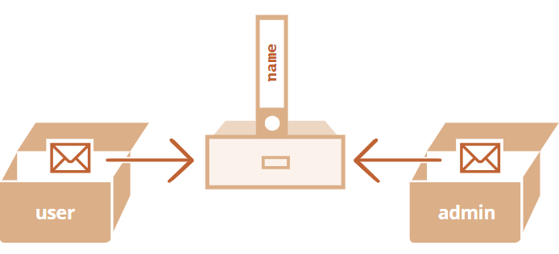
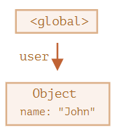
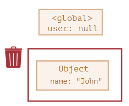
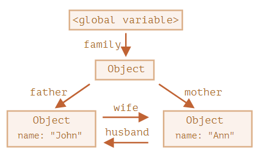
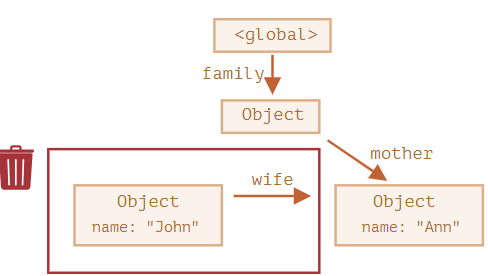
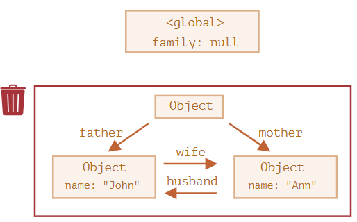

# 객체 기본

[1. 객체](#객체)<br/>
[2. 참조에 의한 객체 복사](#참조에-의한-객체-복사)<br/>
[3. 가비지 컬렉션](#가비지-컬렉터)<br/>
[4. 메서드와 this](#메서드와-this)<br/>
[5. new 연산자와 생성자 함수](#new-연산자와-생성자-함수)<br/>
[6. 옵셔널 체이닝](#옵셔널-체이닝)<br/>
[7. 심볼형](#심볼형)<br/>
[8. 객체를 원시형으로 변환하기](#객체를-원시형으로-변환하기)<br/>

----
<br />

## 객체
- '키:  값' 쌍으로 구성된 프로퍼티
	- 키는 문자열이나 심볼이어야 함(보통은 문자열)
	- 키는 어떤 자료형도 가능
  ```
  let user = {
    name: 'John',
    age: 30,
    'likes birds': true,
  };
  ```
<br/>

- 대괄호 표기법으로 접근 가능
	- `console.log(user['likes birds']); // true`
- 런타임에 평가되기 때문에 사용자 입력값 변경 등에 따라 값이 변경될 수 있음
  ```
  let user = {
    name: 'John',
    age: 30,
  };

  let key1 = prompt('사용자의 어떤 정보를 얻고 싶나요?','name');
  alert(user[key1]); // John (프롬포트에 'name'을 입력한 경우)

  let key2 = 'name'; // 점표기법은 위의 방식이 불가능
  alert(user.key2); // undefined
  ```
<br/>

- 'in' 연산자를 통해 프로퍼티를 확인하거나 나열
  ```
  let user = { name: 'John', age: 30 };
  alert('age' in user); // true
  alert('blabla' in user); // false

  // ---------------
  for(let key in obj) {
    alert(key); // name, age
  }
  ```
<br/>

## 참조에 의한 객체 복사

- 객체는 참조에 의한 복사
  ```
  let user { name: 'John' };
  let admin = user;

  admin.name = 'Pete''; // 'admin' 참조값에 의해 변경
  alert(user.name); // Pete
  ```
  

<br/>

- **비교 시 두 객체가 동일한 경우에 참을 반환**
  ```
  let a1 = {};
  let b1 = a1; // 참조에 의한 복사

  alert(a1 == b1); // true
  alert(a1 === b1); // true
  // ----------------------
  let a2 = {};
  let b2 = {};

  alert(a2 == b2); // false, 독립된 객체이기 때문에 false 변화
  alert(a2 === b2); // false
  ```
<br/>

- `Object.assign`을 활용해 복사 가능(참조에 의한 복사 X)
  ```
  let user = {
    name: 'John',
    age: 30,
  };

  let clone = {}; 

  for(let key in user) {
    clone[key] = user[key];
  }

  clone.name = 'Peter'; // clone은 독립적인 객체, clone 데이터 변경
  alert(user.name); // John, 변함 없음
  ```
<br/>

- 객체에 대한 첨조값일 경우
	- ==user.sizes==는 객체이기 때문에 참조에 의한 복사가 됨
	- user[key]의 각 값을 검사하면서, 반복문 사용 or [_.cloneDeep(obj)_](https://lodash.com/docs#cloneDeep)활용 > '깊은 복사' 가능
  ```
  let user = {
    name: 'John',
    sizes: {
      height: 182,
      width: 50,
    }
  };

  let clone = Object.assign({}, user);
  alert(user.sizes === clone.sizes); // true, 같은 객체
  user.sizes.width++; // user와 clone은 sizes를 공유
  alert(clone.size.width); // 51
  ```
<br/>

## 가비지 컬렉터

- 자바스크립트에서는 '도달 가능한 값'이면 메모리에서 삭제되지 않음
  ```
  let user = { name: 'John' };

  user = null; // 도달 가능성이 사라짐
  ```
    ->  
  - John은 도달할 수 없는 상태가 되었기 때문에 가비지 컬렉터에서 John에 저장된 데이터를 삭제하고, 메모리에서 삭제

<br/>

- 외부에서 나가는 참조는 도달 가능한 상태에 영향을 주지 않음
	- **들어오는 참조만 도달 가능한 상태에 영향을 줌**
  ```
  function marry(man, woman) {
    woman.husband = man;
    man.wife = woman;
    return {
      father: man,
      mother: woman
    }
  }
  let family = marry({
    name: 'John'
  }, {
    name: 'Ann'
  });

  // 참조 객체 두 개 삭제
  delete family.father;
  delete family.mother;
  ```
    ->  
  - John은 도달 가능한 상태가 아니기 때문에 메모리에서 제거

<br/>

- 근원 객체(family)에 아무것도 참조하지 않도록 할 경우(`family = null;`)

	

	- family 객체와 루트의 연결이 사라지면서 John과 Ann은 메모리에서 삭제


<br />

## 메서드와 this

- 객체 프로퍼티에 저장된 함수를 '메서드'라 부름
	- 함수 표현식, 함수 선언식 등으로 미리 생성 후 할당 가능
	- 단축 구문 이용 가능
  ```
  let user = {
    name: 'John',
    age: 30,
  };

  // 함수 표현식
  user.sayHi1 = function() {
    alert('안녕하세요!');
  }

  // 함수 선언식
  function sayHi2() {
    alert('안녕하세요!');
  }

  user.sayHi2 = sayHi2;

  // 단축 구문
  // type1
  user = {
    sayHi3: function() {
      alert('안녕하세요!');
    }
  }

  // type2
  user = {
    sayHi3() {
      alert('안녕하세요!');
    }
  }
  ```

<br />

- 메서드는 `this`로 객체를 참조
  ```
  let user = {
    name: 'John',
    age: 30,
    sayHi() {
      alert(this.name); // 'this'는 현재 객체(user)를 참조
    }
  }

  user.sayHi(); // John
  ```
<br />

- this가 없는 화살표 함수
	- **화살표가 함수에서는 일반 함수와 달리 '고유한' `this`를 가지지 않음**
	- 화살표 함수에서 `this`를 참조하면, '평범한' 외부 함수에서 `this`값을 가져옴
		- ex) `arrow()`의 `this`는 외부 함수 `user.sayHi()`의 `this`가 됨
  ```
  let user = {
    firstName: '보라',
    sayHi() {
      let arrow = () => alert(this.firstName);
      arrow();
    }
  };

  user.sayHi(); // 보라
  // 1. 'arrow()'를 호출하면, 화살표 함수 내부에서 'this'를 참조
  // 2. 'this'는 화살표 함수가 정의된 외부 함수인 'sayHi' 메서드의 'this'를 사용
  // 3. 'this'는 'user' 객체를 가리킴
  ```

<br />

## new 연산자와 생성자 함수

- 유사한 객체를 여러 개 만들 경우 `new` 연산자 사용
	- 내부에 `this`가 암시적으로 만들어지고, `this`를 반환
  ```
  function User(name) {
    // this = {}; (빈 객체가 암시적을 만들어짐)
    // 새로운 프로퍼티를 this에 추가
    this.name = name;
    this.isAdmin = false;

    // return this; (this가 암시적으로 반환 됨)
  }

  let user = new User('보라');

  alert(user.name); // 보라
  alert(user.isAdmin); // false
  ```
<br />

- 생성자 함수에 `return` 문이 있을 경우
	- 객체를 `return` 한다면 `this` 대신 객체가 반환
	- 원시형을 `return` 한다면 `return` 문이 무시됨 (암시적으로 `this`를 반환)
  ```
  // 객체 반환
  function BigUser() {
    this.name = '원숭이';
    return { name: '고릴라' }; // this가 아닌 새로운 객체를 반환
  }

  alert(new BigUser().name); // 고릴라

  // 원시형 반환
  function SmallUser() {
    this.name = '원숭이';
    return; // this를 반환
  }

  alert(new SamllUser().name); // 원숭이
  ```

<br />

## 옵셔널 체이닝

- 중첩 객체를 에러 없이 안전하게 접근 가능
- 이전에는 `&&` 연산을 통해 해결 > 길어지는 코드 문제 해소
	- `user && user.address & user.address.street` -> `user?.address?.street`
- 프로퍼티 접근 시 - `obj?.[prop]` / 메서드 접근 시 - `obj?.method()` 

<br />

## 심볼형

- 객체 키는 문자형이나 심볼형이 될 수 있음
- 유일무이한 식별자를 만드는 데 사용
	- 이름이 같더라도 값이 항상 다름
  ```
  let id1 = Symbol('id');
  let id2 = Symbol('id');

  alert(id1 == ad2); // false
  ```
<br />

- 이름이 같을 때 값도 같길 원한다면 전역 레지스트리를 사용(`Symbol.for(key)`)
  ```
  // 전역 레지스트리에서 심볼을 읽음
  let id = Symbol.for('id'); // 심볼이 존재하지 않으면 새로운 심볼을 만듦

  // 동일한 이름을 이용해 심볼을 다시 읽음
  let idAgain = Symbol.for('id');

  alert(id == idAgain); // true
  ```
<br />

- `Symbol.keyFor(key)`를 이용해 이름을 얻을 수 있음
	- 전역 심볼이 아닌 경우에는 `undefined`를 반환
	- 일반 심볼의 이름을 얻고 싶을 경우 `description` 프로퍼티를 사용
  ```
  let sym1 = Symbol.for('name');
  let sym2 = Symbol.for('id');

  alert(Symbol.keyFor(sym1)); // name
  alert(Symbol.keyFOr(sym2)); // id

  // -----------------------------
  let gloablSymbol = Symbol.for('name');
  let localSymbol = Symbol('name');

  alert(Symbol.keyFor(globalSymbol)); // name, 전역 심볼
  alert(Symbol.keyFor(localSymbol)); // undefined, 전역 심볼 X

  alert(localSymbol.description); // name
  ```

<br />

- 심볼의 주요 사용처
	1. 객체의 '숨김' 프로퍼티 - 외부 스크립트나 라이브러리에 '속한' 객체에 새로운 프로퍼티를 추가해 주고 싶은 경우 심볼 생성
		- `for ... in`의 대상이 되지 않아서 프로퍼티 수정 예방
		- 외부 스크립트나 라이브러리는 심볼 정보를 갖고 있지 않아서 프로퍼티에 직접 접근이 불가능
		- 심볼형 키를 사용하면 프로퍼티가 수정되거나 덮어 씌워지는 것을 예방할 수 있음
	2. '시스템 심볼(system symbol)'은 자바스크립트 내부에서 사용되는 심볼임
		- 시스템 심볼을 활용하면 객체를 미세 조정 가능

<br />

## 객체를 원시형으로 변환하기
- 객체 - 원시형으로의 형 변환은 hint를 기준으로 세 종류로 구분
	- `string` - `alert` 같이 문자열을 필요로 하는 연산
	- `number` - 수학 연산
	- `default` - 연산을 확신할 수 없을 때 드물게 발생

- 객체 - 원시형 변환 순서
  1. `obj[Symbol.toPrimitive](hint)` 메서드가 있는 확인, 있다면 호출
      - 목표하는 자료형(hint)를 명명하는 메서드
      ```
      obj[Symbol.toPrimitive] = function(hint) {
        // 반드시 원시값을 반환해야 함
        // hint는 'string', 'number', 'default' 중 하나가 될 수 있음
      }
      // ------------------------------------------------
      let user = {
        name: 'John',
        money: 1000,
        [Symbol.toPrimitive](hint) {
          alert(`hint: ${hint}`);
          retur hint == 'string' ? `{name: '${this.name}'}` : this.money;
        }
      };

      alert(user); // hint: string -> { name: John }
      alert(+user); // hint: number -> { money: 1000 }
      alert(user + 500); // hint default -> 1500
      ```
  2. 1에 해당하지 않고 hint가 `string`이라면,
      - `obj.toString()`이나 `obj.valueOf()`를 호출
  3. 1과 2에 해당하지 않고, hint가 `number`이나 `default`라면,
      - `obj.valueOf()`나  `obj.toString()`을 호출
      ```
      let user = {
        name: 'John',
        money: 1000,
        toString() { // hint가 'string'인 경우
          return `{name: '${this.name}'}`
        }
        valueOf() { // hint가 'number'이나 'default'인 경우
          return this.money;
        }
      }

      alert(user); // toString -> { name: 'John' }
      alert(+user); // valueOf -> 1000
      alert(user + 500); // valueOf -> 1500
      ```