[1. 재귀와 스택](#재귀와-스택)<br/>
[2. 나머지 매개변수와 전개 구문](#나머지-매개변수와-전개-구문)<br/>
[3. 변수의 유효범위와 클로저](#변수의-유효범위와-클로저)<br/>
[4. 오래된 var](#오래된-var)<br/>
[5. 전역 객체](#전역-객체)<br/>
[6. 객체로서의 함수와 기명 함수 표현식](#객체로서의-함수와-기명-함수-표현식)<br/>
[7. new Function 문법](#new-function-문법)<br/>
[8. setTimeout과 setInterval을 이용한 호출 스케줄링](#settimeout과-setinterval을-이용한-호출-스케줄링)<br/>
[9. call_apply와 데코레이터, 포워딩](#call_apply와-데코레이터-포워딩)<br/>
[10. 함수 바인딩](#함수-바인딩)<br/>
[11. 화살표 함수 다시 살펴보기](#화살표-함수-다시-살펴보기)<br/>

<br/>

---
<br/>

## 재귀와 스택
- 실제 재귀 호출이 자바스크립트 내에서 동작하는 과정
- 실행 중인 함수의 실행 절차에 대한 정보는 해당 함수의 *실행 컨텍스트*엣 저장됨
	- [실행 컨텍스트](https://tc39.github.io/ecma262/#sec-execution-contexts)는 함수 실행에 대한 세부 정보를 담고 있는 내부 데이터 구조
	- 제어 흐름의 현재 위치, 변수의 현재 값, `this`의 값(여기선 다루지 않음) 등 상세 내부 정보가 실행 컨텍스트에 저장
- 중첩 호출이 있을 때의 동작 과정
	- 현재 함수의 실행이 일시 중지
	- 중지된 함수와 연관된 실행 컨텍스트는 _실행 컨텍스트 스택(execution context stack)_ 이라는 특별한 자료 구조에 저장
	- 중첩 호출이 실행
	- 중첩 호출 실행이 끝난 이후 실행 컨텍스트 스택에서 일시 중단한 함수의 실행 컨텍스트를 꺼내오고, 중단한 함수의 실행을 다시 이어감

<br/>

```
function pow(x, n) {
  if (n == 1) {
    return x;
  } else {
    return x * pow(x, n - 1);
  }
}

alert(pow(2, 3));
```

<br/>

- `pow(2, 3)`
	- `pow(2, 3)`을 호출하는 순간, 실행 컨텍스트엔 변수 `x = 2, n = 3`이 저장되고, 실행 흐름은 함수의 첫번 째 줄에 위치
		- 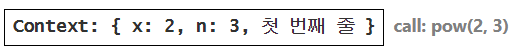
	- `n == 1`을 만족하지 못 하므로 `if`문의 두 번쨰 분기로 넘어감
		- 변수는 동일하지만, 실행 흐름의 위치가 변경되면서 실행 컨텍스트도 다음과 같이 변경
		- 

<br/>

- `pow(2, 3)`
	- 중첩 호출을 하기 위해, 자바스크립트는 *실행 컨텍스트 스택*에 현재 실행 컨텍스트를 저장
	- 서브 호출 `pow(2, 3)`이 시작될 때의 실행 컨텍스트 스택
		- 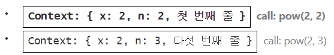
		- 이전 컨텍스트에 변수 정보, 코드가 일시 중단된 줄에 대한 정보가 저장되어 있기 때문에 서브 호출이 끝났을 때 이전 컨텍스트가 문제 없이 다시 시작

<br/>

- `pow(2,1)`
	- `x = 2, n = 1`과 함께 새로운 서브 호출이 만들어짐
	- 새로운 실행 컨텍스트가 만들어지고, 이전 실행 컨텍스트는 스택 최상단에 올라감(push)
		- 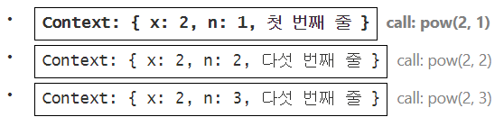

<br/>

- `실행 종료`
	- `n == 1`을 만족시키므로 `if` 문의 첫 번째 분기가 실행
	- 중첩 호출 X > 함수 종료되고 `2` 반환
	- 함수가 종료되었기 때문에 상응하는 실행 컨텍스트는 메모리에서 삭제됨
		- 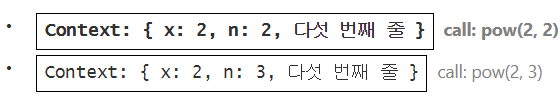
	- `pow(2, 2)` 실행 > `x * pow(x, n -1)`를 계산해 `4` 반환
		- 이전 컨텍스트가 스택 최상단에 위치
		- 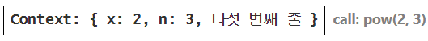
	- 마지막 실행 컨텍스트까지 처리되면 `pow(2, 3) = 8`이라는 결과가 도출

<br/>

- 실행 컨텍스트는 메모리를 차지하므로 재귀를 사용할 때 메모리 요구사항에 유의해야 함(`n`을 늘리면 `n`개의 실행 컨텍스트가 생성됨)
- 반복문과 재귀를 적절히 이용 필요

<br/>

## 나머지 매개변수와 전개 구문
- `...`를 이용해 인수의 개수에 제한 없이 넘겨줄 수 있음
	```
	function showName(firstName, lastName, ...titles) {
	  alert( firstName + ' ' + lastName ); // Bora Lee
	
	  // 나머지 인수들은 배열 titles의 요소가 됩니다.
	  // titles = ["Software Engineer", "Researcher"]
	  alert( titles[0] ); // Software Engineer
	  alert( titles[1] ); // Researcher
	  alert( titles.length ); // 2
	}
	
	showName('Bora', 'Lee', 'Software Engineer', 'Researcher');
	```

<br/>

>[!WARNING] 나머지 매개변수는 항상 마지막에 있어야 합니다.
>
>나머지 매개 변수는 남아 있는 인수를 모으는 역할을 하므로 아래 예시에선 에러가 발생
>`...rest`는 항상 마지막에 있어야 함
>```
>function f(arg1, ...rest, arg2) { // ...rest 후에 arg2가 있으면 안 됩니다.
>// 에러
>}
>```

<br/>

- 스프레드 문법(`...`)을 통해 배열 넘기기
	- 이터러블 객체 `arr`이 인수 목록으로 '확장'됨
	```
	let arr = [3, 5, 1];
	
	// alert(Math.max(arr)); // NaN
	alert(Math.max(...arr)); // 5
	```

<br/>

- 스프레드 문법을 통해 배열과 객체 본사본을 만들 수 있음
- 배열 예시
	```
	let arr = [1, 2, 3];
	let arrCopy = [...arr]; // 배열을 펼쳐서 각 요소를 분리후, 매개변수 목록으로 만든 다음에
	                        // 매개변수 목록을 새로운 배열에 할당함
	
	// 배열 복사본의 요소가 기존 배열 요소와 진짜 같을까요?
	alert(JSON.stringify(arr) === JSON.stringify(arrCopy)); // true
	
	// 두 배열은 같을까요?
	alert(arr === arrCopy); // false (참조가 다름)
	
	// 참조가 다르므로 기존 배열을 수정해도 복사본은 영향 X
	arr.push(4);
	alert(arr); // 1, 2, 3, 4
	alert(arrCopy); // 1, 2, 3
	```
- 객체 예시
	- `Object.assign`을 이용하는 것 보다 간결하게 작성 가
	```
	let obj = { a: 1, b: 2, c: 3 };
	let objCopy = { ...obj }; // 객체를 펼쳐서 각 요소를 분리후, 매개변수 목록으로 만든 다음에
	                          // 매개변수 목록을 새로운 객체에 할당함
	
	// 객체 복사본의 프로퍼티들이 기존 객체의 프로퍼티들과 진짜 같을까요?
	alert(JSON.stringify(obj) === JSON.stringify(objCopy)); // true
	
	// 두 객체는 같을까요?
	alert(obj === objCopy); // false (참조가 다름)
	
	// 참조가 다르므로 기존 객체를 수정해도 복사본은 영향 X
	obj.d = 4;
	alert(JSON.stringify(obj)); // {"a":1,"b":2,"c":3,"d":4}
	alert(JSON.stringify(objCopy)); // {"a":1,"b":2,"c":3}
	```

<br/>

## 변수의 유효범위와 클로저
- 코드 블록 `{...}` 안에서 선언한 변수는 블록 내부에서만 사용할 수 있음
- `if`, `for`, `while` 등의 블록 내부에서 선언한 변수는 오직 블록 내부에서만 접근 가능

<br/>

- 함수 내부에서 선언한 함수는 '중첩(nested)' 함수라 부름
	```
	function sayHiBye(firstName, lastName) {
	  // 헬퍼(helper) 중첩 함수
	  function getFullName() {
	    return firstName + " " + lastName;
	  }
	
	  alert("Hello, " + getFullName());
	  alert("Bye, " + getFullName());	
	}
	```
	- 외부 변수에 접근해 이름 전체를 반환해주는 *중첩* 함수
	- 반환된 중첩 함수는 어디서든 호출해 사용할 수 있음

<br/>

- 호출될 때마다 다음 숫자를 반환해주는 `makeCounter` 함수
	```
	function makeCounter() {
	  let count = 0;
	
	  return function() {
	    return count++;
	  };
	}
	
	let counter = makeCounter();
	
	alert(counter()); // 0
	alert(counter()); // 1
	alert(counter()); // 2
	```
	-> 함수와 중첩 함수 내 `count` 변수엔 어떤 값이 할당되는지
	-> `counter`를 여러개 만들었을 때, 이 함수들은 서로 독립적인지

<br/>

- 렉시컬 환경
	- 환경 레코드 - 모든 지역 변수를 프로퍼티로 저장하고 있는 객체. `this` 값과 같은 기타 정보도 여기에 저장됨
	- 외부 렉시컬 환경에 대한 참조 - 외부 코드와 연관

<br/>

1. 변수
	- **’변수’는 특수 내부 객체인 `환경 레코드`의 프로퍼티일 뿐임. '변수를 가져오거나 변경’하는 것은 '환경 레코드의 프로퍼티를 가져오거나 변경’함을 의미**
	- 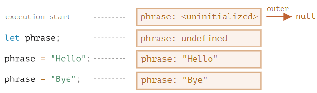<br/>
		- 스크립트가 시작되면(execution start) 스크립트 내에서 선언한 변수 전체가 렉시컬 환경에 올라감
			- `let`을 만나기 전까지 변수를 참조할 수 없음
		- `let phrase`가 선언되었지만 값을 할당하기 전이기 때문에 `undefined`
		- `phrase`에 값 할당
		- `phrase`의 값이 변경
2. 함수 선언문
	- 함수와 마찬가지로 값을 나타냄
	- **함수 선언문(function declaration)으로 선언한 함수는 일반 변수와는 달리 바로 초기화된다는 점에서 차이 존재**
		- 함수 선언문으로 선언한 함수는 렉시컬 환경이 만들어지는 즉시 사용 가능(변수는 `let`을 만나 선언이 될 때까지 사용 불가)
		- 선언되기 전에도 함수를 사용할 수 있는 이유
		- 표현식은 해당 불가
	- 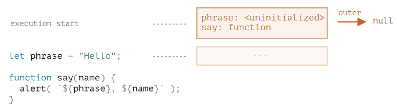
	- 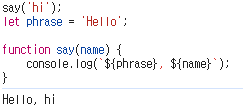
3. 내부와 외부 렉시컬 환경
	- 함수를 호출해 실행하면 새로운 렉시컬 환경이 자동으로 만들어짐
		- 이 렉시컬 환경엔 함수 호출 시 넘겨받은 매개변수와 함수의 지역 변수가 저장됨
	- `say('John')` 호출 시 내부 변화
		- 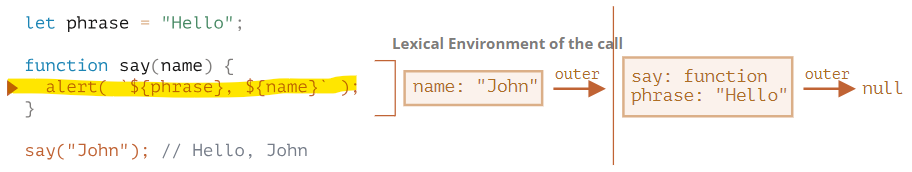<br/>
			- 내부 렉시컬 환경엔 함수의 인자인 `name`으로부터 유래한 프로퍼티 하나만 존재 > `say('John')`을 호출했기 때문에, `name`의 값은 `John`이 됨
			- 외부 렉시컬 환경은 전역 렉시컬 환경임 > `phrase`와 함수 `say`를 프로퍼티로 갖음
	- 코드 접근 방법
		- **내부 렉시컬 환경을 확인한 후에 없으면 내부 렉시컬 환경이 참조하는 외부 렉시컬 환경으로 확장 > 전역 렉시컬 환경으로 확장될 때까지 반복**
		- 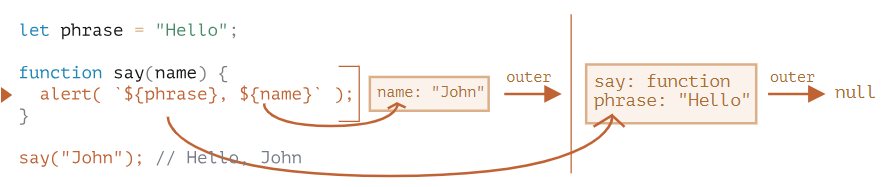
4. 함수를 반환하는 함수
	- `makeCounter` 예시
		```
		function makeCounter() {
		  let count = 0;
		
		  return function() {
		    return count++;
		  };
		}
		
		let counter = makeCounter();
		```
		- `makeCounter()`를 호출할 때마다 새로운 렉시컬 환경 객체가 만들어지고 여기에 `makeCounter`를 실행하는데 필요한 변수들이 저장
		- 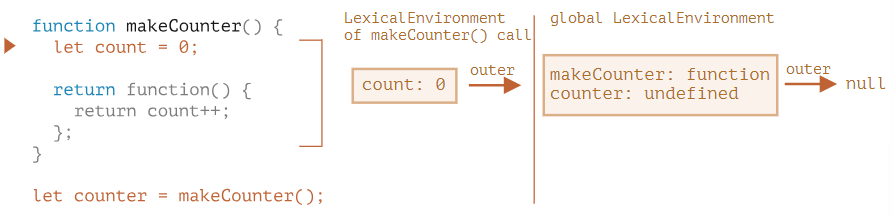
	- 모든 함수는 함수가 생성된 곳의 렉시컬 환경을 기억
		- 함수는 `[[Environment]]`라 불리는 숨김 프로퍼티를 갖는데, 여기에 함수가 만들어진 곳의 렉시컬 환경에 대한 참조가 저장
		- 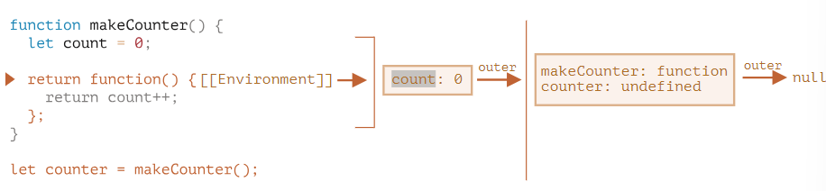<br/>
			- `counter.[[Environment]]`엔 `{ count: 0 }`이 있는 렉시컬 환경에 대한 참조가 저장됨
			- **`[[Environment]]`는 함수가 생성될 때 딱 한 번 값이 세팅되고 영원히 변하지 않음**
	- `counter()`를 호출하면 각 호출마다 새로운 렉시컬 환경이 생성되고, 이 렉시컬 환경은 `counter.[[Environment]]`에 저장된 렉시컬 환경을 외부 렉시컬 환경으로서 참조함
		- 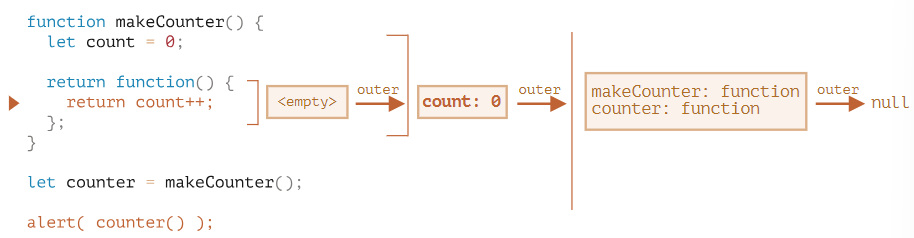<br/>
			- 중첩 함수의 내부로 들어오면 `count` 변수가 필요 > 자제 렉시컬 환경에서 변수를 찾음
			- 익명 중첩 함수에는 지역 변수가 없기 때문에 외부 렉시컬 환경에서 `count를 찾음
			- `count++`가 실행될 때 **변숫값 갱신은 변수가 저장된 렉시컬 환경에서 count 값이 1 증가**
			- 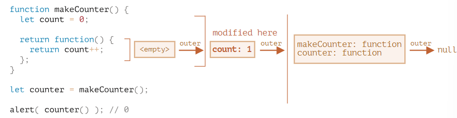<br/>

<br/>

- 함수 호출이 끝나면 함수에 대응하는 렉시컬 환경이 메모리에서 제거됨
- 호출이 끝나도 도달 가능한  함수가 있을 수도 있음
	- 이 중첩 함수의 `[[Environment]]` 프로퍼티에 외부 함수 렉시컬 환경에 대한 정보가 저장됨 > 도달 가능한 상태(메모리 유지)
	```
	function f() {
	  let value = 123;
	
	  return function() {
	    alert(value);
	  }
	}
	
	let g = f(); // g.[[Environment]]에 f() 호출 시 만들어지는
	// 렉시컬 환경 정보가 저장됩니다.
	```
 -> 자바스크립트 엔진이 이를 지속해서 최적화 함
 -> 외부 변수가 사용되지 않는다고 판단되면 이를 메모리에서 제거

<br/>

> [!INFO] 클로저
>
> - 상위 스코프의 식별자를 참조하고 있고, 본인의 외부 함수보다 더 오래 살아있다면 클로저
> - 실행 스택에서 제거된(생명 주기가 끝난) 외부 함수의 변수에 접근할 수 있는 함수
> ```
> const x = 1;
> function outer() {
> 	const x= 10;
> 	// 내부 함수에서 외부 함수의 변수에 접근할 수 있음 
> 	const inner = function () {
> 		console.log(x);
> 	};
> 	return inner;
> }
> 
> const ella = outer(); // inner 함수를 반환하고 실행 스택에서 제거됨
> ella(); // 10 (Environment에 의해 당시 환경을 기억하고 있기 때문에 변수 x의 값인 10을 출력)
>```


<br/>

## 오래된 var
- `var`는 블록 스코프가 아닌 함수 스코프
	```
	if (true) {
	  var test = true;
	}
	
	alert(test); // true(if 문이 끝났어도 변수에 여전히 접근할 수 있음)
	
	// 함수 내부 변수에는 접근 불가능
	function sayHi() {
	  if (true) {
	    var phrase = "Hello";
	  }
	
	  alert(phrase); // Hello, 제대로 출력됨
	}
	
	sayHi();
	alert(phrase); // Error: phrase is not defined
	```

<br/>

- 중복 선언 가능
	```
	var user = "Pete";
	
	var user = "John"; //
	// ...에러 또한 발생 X
	
	alert(user); // John
	```
	
<br/>

- `var`는 함수가 시작되는 시점에서 처리
	```
	function sayHi() {
	  phrase = "Hello"; // (*)
	
	  if (false) {
	    var phrase;
	  }
	
	  alert(phrase);
	}
	sayHi();
	```
	- 변수가 끌어 올려지는 현상을 '호이스팅'이라 부름
	- `var`로 선언한 모든 변수는 함수의 최상위로 '끌어 올려지기' 때문

<br/>

- **선언은 호이스팅 되지만 할당은 호이스팅 되지 않음**
	```
	function sayHi() {
	  var phrase; // 선언은 함수 시작 시 처리
	
	  alert(phrase); // undefined
	
	  phrase = "Hello"; // 할당은 실행 흐름이 해당 코드에 도달했을 때 처리
	}
	
	sayHi();
	```
	- `var` 선언은 함수 시작시 처리되기 때문에 어디든 참조할 수 있지만 할당하기 전까진 값이 undefined

<br/>

## 전역 객체
- 브라우저 환경에선 전역 객체를 `window`, Node.js 환경에선 `global`이라고 부름
- 브라우저에서 `let` 이나 `const`가 아닌 `var`로 선언한 전역 변수는 전역 객체의 프로퍼티가 됨
	```
	var gVar = 5;
	let gLet = 5;
	
	alert(window.gVar); // 5 (var로 선언한 변수는 전역 객체 window의 프로퍼티가 됨)
	alert(window.gLet); // undefined (let으로 선언한 변수는 전역 객체의 프로퍼티가 되지 않음)
	```

<br/>

- 직접 전역 객체 프로퍼티 추가 가능 > 어디서든 사용 가능해짐
	```
	// 모든 스크립트에서 현재 사용자(current user)에 접근할 수 있게 이를 전역 객체에 추가함
	window.currentUser = {
	  name: "John"
	};
	
	// 아래와 같은 방법으로 모든 스크립트에서 currentUser에 접근할 수 있음
	alert(currentUser.name);  // John
	
	// 지역 변수 'currentUser'가 있다면
	// 지역 변수와 충돌 없이 전역 객체 window에서 이를 명시적으로 가져올 수 있음
	alert(window.currentUser.name); // John
	```

<br/>

- 폴리필 - 브라우저가 최신 자바스크립트 기능을 지원하는 여부를 확인한 후 없으면 직접 함수를 만들어 전역 객체에 추가하는 방식
	```
	if (!window.Promise) {
	  window.Promise = ... // 모던 자바스크립트에서 지원하는 기능을 직접 구현함
	}
	```
	
<br/>

## 객체로서의 함수와 기명 함수 표현식
- 객체로서 함수에 사용할 수 있는 프로퍼티
	- `name` - 함수의 이름이 저장. 함수 선언부에서 이름을 가져오는데, 선언부에 이름이 없는 경우엔 자바스크립트 엔진이 컨텍스트(할당 등)을 이용해 이름을 추론
		```
		// 햠수 선언문
		function sayHi() {
		  alert("Hi");
		}
		
		alert(sayHi.name); // sayHi
		
		// 익명 함수
		let sayHi = function() {
		  alert("Hi");
		};
		
		alert(sayHi.name); // sayHi (익명 함수이지만 이름이 존재)
		```
	- `length` - 함수 선언부에 있는 인수의 수로 나머지 매개변수는 포함되지 않음
		```
		function f1(a) {}
		function f2(a, b) {}
		function many(a, b, ...more) {}
		
		alert(f1.length); // 1
		alert(f2.length); // 2
		alert(many.length); // 2
		```

<br/>

- 커스텀 프로퍼티를 추가할 수 있음 -> 외부에서 값에 접근 가능해지는 문제 발생 -> 기명 함수로 대체 가능
	```
	function makeCounter() {
	  // let count = 0 대신 아래 메서드(프로퍼티)를 사용함 
	  function counter() {
	    return counter.count++;
	  };
	  
	  counter.count = 0;
	
	  return counter;
	}
	
	let counter = makeCounter();
	
	counter.count = 10;
	alert(counter()); // 10
	```

<br/>

- 기명 함수 표현식 - 이름이 있는 함수 표현식
	```
	// 일반 함수 표현식
	let sayHi = function(who) { 
	  alert(`Hello, ${who}`);
	};
	
	// 기명 함수 표현식
	let sayHi = function func(who) {
	  alert(`Hello, ${who}`);
	};
	```
	- 이름을 사용해 함수 표현식 내부에서 자기 자신을 참조할 수 있음
	- 기명 함수 표현식 외부에선 그 이름을 사용할 수 없음

<br/>

- 함수 `sayHi`의 코드 예시
	- `sayHi`는 `who`에 값이 없는 경우, 인수 `'Guest'`를 받고 자기 자신을 호출
	```
	let sayHi = function func(who) {
	  if (who) {
	    alert(`Hello, ${who}`);
	  } else {
	    func("Guest"); // func를 사용해서 자신을 호출합니다.
	  }
	};
	
	sayHi(); // Hello, Guest
	
	// 하지만 아래와 같이 func를 호출하는 건 불가능합니다.
	func(); // Error, func is not defined (기명 함수 표현식 밖에서는 그 이름에 접근 X)

	let welcome = sayHi;
	sayHi = null;
	welcome(); // Hello, Guest
	```
	- `func`이라는 이름의 함수는 지역 수준에 존재하므로 외부 렉시컬 환경에서 찾지 않아도 됨

<br/>

## new Function 문법
- `new Function`을 이용하면 함수 생성 가능 < 잘 사용하지 않는 방식
	```
	let func = new Function ([arg1, arg2, ...argN], functionBody);
	```

<br/>

- 기존 함수와 다르게 런타임에 받은 문자열을 사용해 함수를 만들 수 있음
	```
	let sayHi = new Function('alert("Hello")');
	
	sayHi(); // Hello
	```

<br/>

- 기존 함수는 `[[Environment]]`에 의해 함수가 만들어진 곳의 렉시컬 환경에 대한 참조가 저장됨
- `new Function`을 이용해 함수를 만들면 함수의 `[[Environment]]` 현재 렉시컬 환경이 아닌 전역 렉시컬 환경을 참조함
	```
	// 일반 함수
	function getFunc() {
	  let value = "test";
	
	  let func = function() { alert(value); };
	
	  return func;
	}
	
	getFunc()(); // getFunc의 렉시컬 환경에 있는 값 "test"가 출력됩니다.
	
	// new Function 함수
	function getFunc() {
	  let value = "test";
	
	  let func = new Function('alert(value)');
	
	  return func;
	}
	
	getFunc()(); // ReferenceError: value is not defined
	```

<br/>

## setTimeout과 setInterval을 이용한 호출 스케줄링
- `setTimeout(func, delay, ...args)`은 `delay`밀리초 후에 `func`을 한 번 실행하도록 해줌
	```
	function sayHi() {
	  alert('안녕하세요.');
	}
	
	setTimeout(sayHi, 1000);
	```

<br/>

- `clearTimeout`으로 스케줄링을 취소함
	```
	let timerId = setTimeout(...);
	clearTimeout(timerId);
	```

<br/>

- `setInterval`은 함수를 주기적으로 실행함
	- 함수 호출을 중단하려면 `clearInterval`를 사용
	```
	let timerId = setInterval(() => alert('째깍'), 2000); // 2초 간격으로 메세지 알림
	
	setTimeout(() => { clearInterval(timerId); alert('정지'); }, 5000); // 5초 후에 정지
	```

<br/>
	
- 중첩 `setTimeout`과 `setInterval`의 차이
	- `setTimeout` - 지연 간격 보장
		```
		let i = 1;
		setTimeout(function run() {
		  func(i++);
		  setTimeout(run, 100);
		}, 100); // 100밀리초마다 실행
		```
		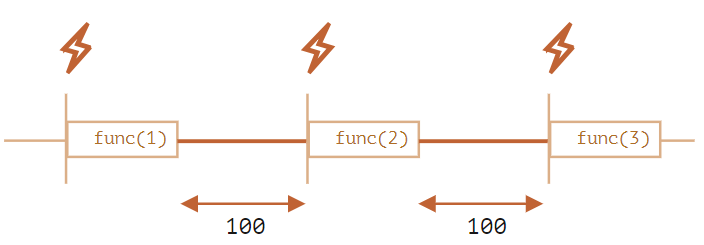
	- `setInterval` - 지연 간격 보장 X
		```
		let i = 1;
		setInterval(function() {
		  func(i++);
		}, 100); // 100밀리초마다 실행
		```
		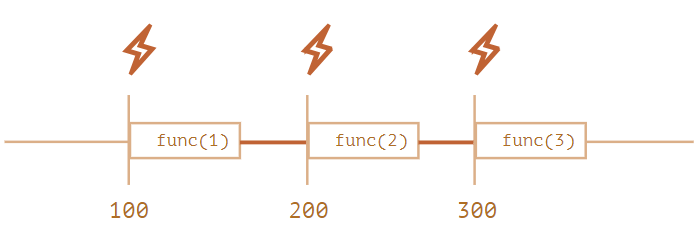
		- '소모되는' 시간도 지연 간격에 포함

<br/>

- `fucn` 실행 시간 > 지연 간격 시간 - `func`의 실행이 종료되면 엔진은 스케줄러를 확인하고, 지연 시간이 지났으면 다음 호출을 *바로* 시작함

<br/>

## call_apply와 데코레이터, 포워딩
- `call`/`apply` - `this`를 명시적으로 고정해 함수를 호출할 수 있게 해줌
	-  `func.call(context, arg1, arg2, ...)`
		```
		function say(phrase) {
		  alert(this.name + ': ' + phrase);
		}
		
		let user = { name: "John" };
		
		// this엔 user가 고정되고, "Hello"는 메서드의 첫 번째 인수가 됨
		say.call(user, "Hello"); // John: Hello
		```
	- `func.apply(context, args)`
		```
		function say(phrase) {
		  alert(this.name + ': ' + phrase);
		}
		
		let user = { name: "John" };
		
		// this엔 user가 고정되고, ["Hello"] 배열의 첫 번째 요소가 메서드의 첫 번째 인수가 됨
		say.apply(user, ["Hello"]); // John: Hello
		```
	- 차이점 - `call`은 인수 값을 따로 받는 대신 `apply`는 유사 배열 객체로 받음
		```
		function say(phrase1, phrase2) {
		  alert(this.name + ': ' + phrase1 + ' ' + phrase2);
		}
		
		let user1 = { name: "call" };
		say.call(user, "Hello", "World"); // call: Hello World
		
		let user2 = { name: "apply" };
		say.apply(user2, ["Hello", "World"]); // apply: Hello World
		
		```

<br/>

- 데코레이터 - 함수를 감싸는 래퍼로 함수의 행동을 변화시킴
	- `apply`와 `call`은 데코레이터를 구현할 때 유용
	```
	function doSomething(message) {
	    alert(`${message}`);
	}
	
	function DecoratorCall(func) {
	    return function(...args) {
	        return func.call(this, ...args); // 'this' 유지
	    };
	}
	
	function DecoratorApply(func) {
	    return function(...args) {
	        return func.apply(this, args); // 'this' 유지
	    };
	}
	
	const res1 = DecoratorCall(doSomething);
	const res2 = DecoratorApply(doSomething);
	
	res1('Hello!'); // Hello!
	res2('Hello!'); // Hello!
	```

<br/>

## 함수 바인딩
- 내장 메서드 [bind](https://developer.mozilla.org/ko/docs/Web/JavaScript/Reference/Global_Objects/Function/bind)를 이용해 `this`를 수정
- `let boundFunc = func.bind(context);`
	- `this`가 `context`로 고정된 함수 `func`을 반환
	```
	let user = {
	  firstName: "John"
	};
	
	function func() {
	  alert(this.firstName);
	}
	
	let funcUser = func.bind(user);
	funcUser(); // John
	```

<br/>


## 화살표 함수 다시 살펴보기
- 화살표 함수엔 `this`가 없음 > 외부 함수에서 `this` 값을 가져옴
	```
	let group = {
	  title: "1모둠",
	  students: ["보라", "호진", "지민"],
	
	  showList() {
	    this.students.forEach(
	      student => alert(this.title + ': ' + student)
	    );
	  }
	};
	
	group.showList();
	```
	- `this.title`은 화살표 함수 바깥에 있는 `showList`가 가리키는 대상과 동일 > `this.title`은 `group.title`과 동일

<br/>

- 화살표 함수엔 `arguments`가 없음