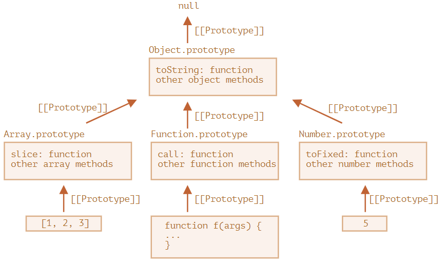

[1. 프로토타입 상속](#프로토타입-상속) <br />
[2. 함수의 prototype 프로퍼티](#함수의-prototype-프로퍼티)<br />
[3. 내장 객체의 프로토타입](#내장-객체의-프로토타입)<br />
[4. 프로토타입 메서드와 __proto__가 없는 객체](#프로토타입-메서드와-__proto__가-없는-객체)<br />

---
### 프로토타입 상속
- 프로토타입 상속을 이용해 객체를 복사하거나 다시 구현하지 않고 쉽게 추가할 수 있음
- 자바스크립트의 객체는 `[[Prototype]]`이라는 숨김 프로퍼티를 가짐 > `null`이거나 다른 객체를 참조함
	- 다른 객체를 참조하는 경우 '프로토타입(prototype)'이라 부름
- `object`에서 프로퍼티가 없으면 자바스크립트는 자동으로 숨김 프로퍼티를 찾음 > '프로토타입 상속'
	```
	let animal = {
	  eats: true
	};
	let rabbit = {
	  jumps: true
	};
	
	rabbit.__proto__ = animal; 
	```

>[!NOTE] `__proto__`는 `[[Prototype]]`용 getter·setter입니다.
> - `__proto__`는 `[[Prototype]]`의 getter(획득자)이자 setter(설정자)
> - `__proto__`를 사용할 수 있지만 최근에는 `Object.getPrototypeOf`나 `Object.setPrototypeOf`를 써서 프로토타입을 획득(get)하거나 설정(set)함

<br />

- 상속을 통해 다른 객체에 구현된 프로퍼티와 메서드를 사용할 수 있음
	```
	let animal = {
	  eats: true,
	  walk() {
	    alert("동물이 걷습니다.");
	  }
	};
	
	let rabbit = {
	  jumps: true,
	  __proto__: animal
	};
	
	// 메서드 walk는 rabbit의 프로토타입인 animal에서 상속받았음
	alert(rabbit.eats); // true
	rabbit.walk(); // 동물이 걷습니다.
	
	```

<br />

- 프로토타입 체인
	```
	let animal = {
	  eats: true,
	  walk() {
	    alert("동물이 걷습니다.");
	  }
	};
	
	let rabbit = {
	  jumps: true,
	  __proto__: animal // animal 객체를 프로토타입으로 상속받음
	};
	
	let longEar = {
	  earLength: 10,
	  __proto__: rabbit // rabbit 객체를 프로토타입으로 상속받음
	};
	
	// 메서드 walk는 프로토타입 체인을 통해 상속받음
	longEar.walk(); // 동물이 걷습니다.
	alert(longEar.jumps); // true (rabbit에서 상속받음)
	```
- 프로토타입 체인 제약 사항
	1. 순환 참조 허용 X - `__proto__`를 이용해 닫힌 형태로 다른 객체를 참조하면 에러가 발생
	2. `__proto__`의 값은 객체나 `null`만 가능 (다른 자료형 무시)
	3. 객체엔 오직 하나의 `[[Porotype]]`만 있을 수 있음

<br />

- 프로토타입은 읽기 전용 작업임 > 추가/수정/삭제는 객체에 직접 해야 함
- 접근자 프로퍼티는 setter 함수를 이용해 값을 할당하므로 프로퍼티가 객체에 직접 추가/수정/삭제 되는 것이 아니라 setter 함수가 실행됨
	```
	let user = {
	  name: "John",
	  surname: "Smith",
	
	  set fullName(value) {
	    [this.name, this.surname] = value.split(" ");
	  },
	
	  get fullName() {
	    return `${this.name} ${this.surname}`;
	  }
	};
	
	let admin = {
	  __proto__: user,
	  isAdmin: true
	};
	
	alert(admin.fullName); // John Smith (*)
	
	// setter 함수가 실행됨
	admin.fullName = "Alice Cooper"; // (**)
	
	alert(admin.fullName); // Alice Cooper, setter에 의해 추가된 admin의 프로퍼티(name, surname)에서 값을 가져옴
	alert(user.fullName); // John Smith, 본래 user에 있었던 프로퍼티 값
	```
	- `(*)` - `user`엔 getter 함수 `get fullName`이 있기 때문에 `get fullName`이 호출
	- `(**)` - setter 함수 `set fullName`이 있기 떄문에 `set fullName`이 호출 (admin에 fullName이라는 프로퍼티 추가 X)

<br />

- **프로토타입 호출 시 `this`는 언제나 `.` 앞에 있는 객체를 가리킴**
	- 위의 코드 예제에서 `admin.fullName = `으로 setter 함수를 호출할 때, `this`는 `admin`이 됨

<br />

- `for..in` 메소드는 상속 프로퍼티도 순회 대상으로 포함함
- [obj.hasOwnProperty(key)](https://developer.mozilla.org/ko/docs/Web/JavaScript/Reference/Global_Objects/Object/hasOwnProperty)를 이용하면 상속 프로퍼티인지 구분 가능
	- `obj`에 직접 구현되어 있는 프로퍼티일 때만 `true`를 반환
	```
	let animal = {
	  eats: true
	};
	
	let rabbit = {
	  jumps: true,
	  __proto__: animal
	};
	
	for(let prop in rabbit) {
	  let isOwn = rabbit.hasOwnProperty(prop);
	
	  if (isOwn) {
	    alert(`객체 자신의 프로퍼티: ${prop}`); // 객체 자신의 프로퍼티: jumps
	  } else {
	    alert(`상속 프로퍼티: ${prop}`); // 상속 프로퍼티: eats
	  }
	}
	```

>[!NOTE] 키-값을 순회하는 메서드 대부분은 상속 프로퍼티를 제외하고 동작합니다.
>
>`Obeject.keys`, `Object.values` 같이 객체의 키-값을 대상으로 하는 메서드 대부분은 상속 프로퍼티를 제외하고 동작함. 프로토타입에서 상속 받은 프로퍼티는 *제외하고*, 해당 객체에서 정의한 프로퍼티만 연산 대상에 포함함

<br />

### 함수의 prototype 프로퍼티
- 생성자 함수를 사용해 객체를 만들었을 때의 프로토타입이 어떻게 동작하는지 학습함

- 생성자 함수(`Rabbit`)의 프로토타입을 의미하는 `Rabbit.prototype`에서 `prototype`은 `Rabbit`에 정의된 일반 프로퍼티임
	```
	let animal = {
	  eats: true
	};
	
	function Rabbit(name) {
	  this.name = name;
	}
	
	Rabbit.prototype = animal;
	
	let rabbit = new Rabbit("흰 토끼"); //  rabbit.__proto__ == animal
	
	alert( rabbit.eats ); // true
	```
	- `Rabbit.prototype = animal`은 '`new Rabbit`을 호출해 만든 새로운 객체의 `[[Prototype]]`을 `animal`로 설정하라'는 것을 의미

>[!NOTE] `F.prototype`은 `new F`를 호출할 때만 사용됩니다.
>- `F.prototype` 프로퍼티는 `new F`를 호출할 때만 사용됨
>- `new F`를 호출할 때 만들어지는 새로운 객체의 `[[Prototype]]`을 할당해 줌
>- 새로운 객체가 만들어진 후에 `F.prototype` 프로퍼티가 바뀌면(`F.prototype = <another object>`) `new F`를 호출해 만드는 또 다른 새로운 객체는 another object를 `[[Prototype]]` 으로 갖게 됨
>	- 기존에 있던 객체의 `[[Prototype]]`은 그대로 유지

<br />

- 디폴트 프로퍼티 - `constructor` 프로퍼티 하나만 있는 객체 (`constructor` 프로퍼티는 자신을 가리킴)
	- 새로운 객체를 만들 때 사용 - 어떤 생성자가 사용되었는지 알 수 없는 경우(ex. 객체가 서드 파티 라이브러리에서 온 경우)에 유용
	```
	function Rabbit(name) {
	  this.name = name;
	  alert(name);
	}
	
	let rabbit = new Rabbit("흰 토끼");
	alert(rabbit.constructor === Rabbit); // true (자기 자신을 가리킴)
	
	let rabbit2 = new rabbit.constructor("검정 토끼");
	```

<br />

- 함수의 기본적인 설정인 `prototype` 프로퍼티 값을 다른 객체로 바뀌었을 때의 변화 과정
	```
	function Rabbit() {} // 생성자 함수
	Rabbit.prototype = {
	  jumps: true
	};
	
	let rabbit = new Rabbit();
	alert(rabbit.constructor === Rabbit); // false (생성자 함수를 사용해 객체를 선언했지만 constructor가 존재하지 않음)
	```
	1. `prototype` 전체를 덮어쓰지 말고 디폴트 `prototype`에 원하는 프로퍼티를 추가/제거
		```
		function Rabbit() {}
		
		// Rabbit.prototype 전체를 덮어쓰지 말고
		// 원하는 프로퍼티가 있으면 그냥 추가
		Rabbit.prototype.jumps = true
		// 이렇게 하면 디폴트 프로퍼티 Rabbit.prototype.constructor가 유지됨
		```
	2. 만약 덮어 썼으면 `constructor`를 수동으로 생성
		```
		Rabbit.prototype = {
		  jumps: true,
		  constructor: Rabbit
		};
		
		// 수동으로 constructor를 추가해 주었기 때문에 우리가 알고 있던 constructor의 특징을 그대로 사용할 수 있음
		```

### 내장 객체의 프로토타입
- `Array`, `Date`, `Function`을 비롯한 내장 객체들은 프로토타입에 메서드를 저장해 놓음 ex) `Array.prototype`, `Date.prototype`, `Object.prototype` 등
	


<br />

- 배열 내장 객체의 프로토타입 확인 예시
	```
	let arr = [1, 2, 3];
	
	// arr은 Array.prototype을 상속벋움
	alert(arr.__proto__ === Array.prototype); // true
	
	// arr은 Object.prototype을 상속받음
	alert(arr.__proto__.__proto__ === Object.prototype); // true
	
	// 체인 맨 위엔 null이 존재
	alert(arr.__proto__.__proto__.__proto__); // null
	```
- 함수 내장 객체의 프로토타입 확인 예시
	```
	function f() {}
	
	alert(f.__proto__ == Function.prototype); // true
	alert(f.__proto__.__proto__ == Object.prototype); // true, 객체에서 상속받음
	```

<br />

- 체인 상의 프로토타입에는 중복 메서드가 존재할 수 있음
	- `Array.prototype`과 `Object.prototype`에는 `toString` 메서드가 존재 (메서드 중복) > 체인 상에서 가까운 곳의 메서드가 사용됨
	```
	let arr = [1, 2, 3]
	alert(arr); // 1,2,3 <-- Array.prototype.toString의 결과
	```

<br />

- 원시값 또한 래퍼 객체의 프로토타입에 `Number.prototype`, `String.prototype`, `Boolean.prototype` 같은 메서드를 저장함
	- `undefined`와 `null`은 예외

<br />

- 네이티브 프로토타(내장 프로토타입은 수정 가능
	```
	String.prototype.show = function() {
	  alert(this);
	};
	
	"BOOM!".show(); // BOOM!
	```
	- 프로토타입은 전역으로 영향을 미치기 때문에 수정하는 것을 지양

<br />

- **폴리피를 만들 경우 허용**
	- 폴리필 - 명세서에는 정의되어 있으나 특정 자바스크립트 엔진에서는 해당 기능이 구현되어있지 않을 때
	```
	if (!String.prototype.repeat) { // repeat이라는 메서드가 없다고 가정합시다
	  // 프로토타입에 repeat를 추가
	
	  String.prototype.repeat = function(n) {
	    // string을 n회 반복(repeat)합니다.
	
	    // 실제 이 메서드를 구현하려면 더 복잡한 코드가 필요합니다.
	    // 전체 알고리즘은 명세서에서 확인할 수 있는데,
	    // 명세서를 완벽히 구현하지 않은 폴리필이라도 충분히 쓸만하니 예시는 이 정도로만 작성해보겠습니다.
	    return new Array(n + 1).join(this);
	  };
	}
	
	alert( "라".repeat(3) ); // 라라라
	```

### 프로토타입 메서드와 `__proto__`가 없는 객체
- 최근에는 `__proto__` 대신 아래의 메서드를 사용해 프로토타입을 설정함
	- [Object.create(proto, [descriptors])](https://developer.mozilla.org/ko/docs/Web/JavaScript/Reference/Global_Objects/Object/create) – `[[Prototype]]`이 `proto`를 참조하는 빈 객체를 생성 (이때 프로퍼티 설명자를 추가로 넘길 수 있음)
	- [Object.getPrototypeOf(obj)](https://developer.mozilla.org/ko/docs/Web/JavaScript/Reference/Global_Objects/Object/getPrototypeOf) – `obj`의 `[[Prototype]]`을 반환 (getter)
	- [Object.setPrototypeOf(obj, proto)](https://developer.mozilla.org/ko/docs/Web/JavaScript/Reference/Global_Objects/Object/setPrototypeOf) – `obj`의 `[[Prototype]]`이 `proto`가 되도록 설정 (setter)
	```
	let animal = {
	  eats: true
	};
	
	// 프로토타입이 animal인 새로운 객체를 생성
	let rabbit = Object.create(animal);
	
	// 설명자를 선택적으로 전달할 수 있음
	let rabbit2 = Object.create(animal {
		jumps: {
			value: true
		}
	});
	
	alert(rabbit.eats); // true
	alert(rabbit2.jumps); // true
	
	alert(Object.getPrototypeOf(rabbit) === animal); // true
	
	Object.setPrototypeOf(rabbit, {}); // rabbit의 프로토타입을 {}으로 변경
	```

<br />

- `__proto__`가 함수 `getPrototypeOf`, `setPrototypeOf`로 대체한 이유
	- `__proto__`를 키로 사용하면 오류가 발생
	```
	let obj = {};
	
	let key = prompt("입력하고자 하는 key는 무엇인가요?", "__proto__");
	obj[key] = "...값...";
	
	alert(obj[key]); // "...값..."이 아닌 [object Object]가 출력됨
	```

<br />

- 위와 같은 문제 발생 시 `맵`을 사용하거나 `Object.create(null)`을 활용해서 예방
	```
	let obj = Object.create(null);
	
	let key = prompt("입력하고자 하는 key는 무엇인가요?", "__proto__");
	obj[key] = "...값...";
	
	alert(obj[key]); // "...값..."이 제대로 출력됨
	```